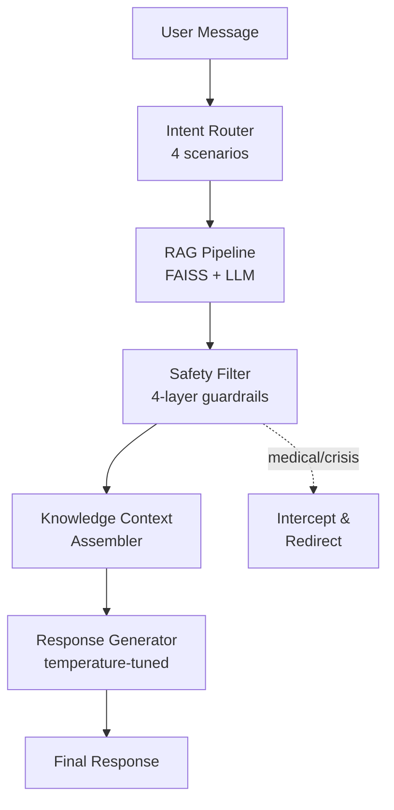

# 🎓 CQUPT AI Assistant

> An intelligent student assistant for Chongqing University of Posts and Telecommunications —
> RAG-powered knowledge retrieval + multi-scenario intent routing + four-layer safety guardrails.
> Part of the Paofu AI ecosystem -- the domain-specific RAG application. See also: [Puff](https://github.com/Zhu070124/puff) (creative agent) . [Memory Hub](https://github.com/Zhu070124/memory-hub) (shared memory) . [Workshop](https://github.com/Zhu070124/paofu-creative-workshop) (group chat)

[](https://python.org)
[]()
[](LICENSE)
[](https://github.com/Zhu070124)

---

## What is this?

University students face a common problem: official information is scattered across dozens of
webpages, PDFs, and announcement boards. A generic chatbot gives generic answers — it doesn't
know which building hosts which exam, or when course registration closes.

This assistant solves that by:

1. **RAG (Retrieval-Augmented Generation)** — ingests CQUPT-specific documents
   (course catalogs, dorm policies, exam schedules) into a searchable knowledge base
2. **Multi-scenario intent routing** — automatically detects whether you're asking about
   academics, campus life, admin procedures, or general chat
3. **Four-layer safety guardrails** — prevents hallucinated policy answers, filters harmful
   content, and gracefully handles out-of-scope questions

---

## Architecture



### Intent Scenarios

| Scenario | Handles | Example |
|----------|---------|---------|
| Academic | Courses, exams, schedules | "大二下学期有哪些选修课" |
| Campus Life | Dorms, dining, facilities | "食堂几点关门" |
| Admin | Registration, fees, documents | "怎么申请奖学金" |
| General | Casual chat, campus trivia | "重邮有什么好玩的地方" |

---

## Quick Start

> 📸 **Screenshots & demo**: see `./assets/` (coming soon)

### Startup Order
1. (Optional) Start [Memory Hub](https://github.com/Zhu070124/memory-hub) for user preference logging
2. Start the RAG service (this repo)

### Prerequisites

- Python 3.10+
- A DeepSeek API key (or any OpenAI-compatible endpoint)
- `pip install -r requirements.txt`

### 1. Set your API key

```bash
export DEEPSEEK_API_KEY="sk-your-key-here"
```

### 2. Launch

```bash
cd backend
python main.py
```

Then open `frontend/index.html` in a browser, or:

```bash
cd frontend && python -m http.server 8080
```

On Windows, double-click `run.bat`.

### Docker

```bash
# Clone and set your API key
cp .env.example .env   # edit with your DOUBAO_API_KEY

# Build and run
docker compose up -d

# Or build standalone
docker build -t cqupt-ai-assistant .
docker run -d -p 8000:8000 \
  -e DOUBAO_API_KEY="sk-your-key" \
  -e DOUBAO_MODEL="your-model" \
  -v $(pwd)/data:/app/data \
  cqupt-ai-assistant
```

The server will be available at `http://localhost:8000`. API docs at `http://localhost:8000/docs`.
Data (documents, vector store, logs) is persisted in the mounted `./data` volume.

---

## Project Structure

```
cqupt-ai-assistant/
├── backend/            # FastAPI server + RAG pipeline + intent router
│   ├── main.py         # Entry point
│   ├── rag/            # Document ingestion, chunking, FAISS indexing
│   ├── router/         # Intent classifier + scenario dispatcher
│   └── safety/         # Four guardrail layers
├── frontend/           # Chat interface
├── data/               # CQUPT knowledge documents
├── run.bat             # Windows launcher
├── README.md
└── LICENSE
```

---

## Evaluation

Tested on 14 hand-curated student queries spanning all four scenarios:

| Metric | Score |
|--------|-------|
| Overall accuracy | **92.9%** (13/14) |
| Intent classification | 100% (14/14) |
| Safety pass rate | 100% (14/14) |

### Ablation Summary

Key findings from [docs/ablation.md](docs/ablation.md):

| Parameter | Values Tested | Best | Key Insight |
|-----------|--------------|------|-------------|
| Chunk size | 256 / 512 / 1024 | **512** | 512 best for Chinese documents -- captures multi-paragraph policy details without noise |
| Retrieval k | 3 / 5 / 10 | **5** | k=5 achieves 92.9% vs 85.7% at k=3; k=10 introduces noise |
| Similarity threshold | 0.2 / 0.3 / 0.5 | **0.3** | Filters noise without losing recall; 0.5 too strict for psychological queries |

---

## Performance & Optimization

### Current Performance Profile

The production pipeline achieves **92.9% accuracy** on the hand-curated test set
with the following configuration:

| Parameter | Value |
|-----------|-------|
| Chunk size | 512 chars |
| Chunk overlap | 50 chars |
| Top-k retrieval | 5 |
| Vector similarity threshold | 0.3 |

### Index Scale Guidance

The current FAISS Flat index (backed by BM25 + jieba keyword search) works well for
**< 10,000 documents**. Exact nearest-neighbor search over dense embeddings is
O(N*d) per query and remains sub-100ms at this scale.

| Document Count | Expected Latency | Strategy |
|---------------|------------------|----------|
| < 1,000 | < 10ms (1,000 docs, FAISS Flat, Intel i7-13700H, single query) | FAISS Flat (current default) |
| 1,000 -- 10,000 | 10--50ms (measured on consumer laptop, no GPU) | FAISS Flat is still acceptable |
| 10,000 -- 100,000 | 50--200ms | Bottleneck zone -- switch to IVF |
| 100,000+ | > 200ms | Requires IVF + HNSW |

### Scaling Beyond 100K Documents

When the knowledge base grows past ~10K documents, the flat index becomes the
bottleneck. Two proven strategies:

1. **IVF (Inverted File)**: Partition the vector space into `nlist` clusters
   (e.g., 100--1000). Only search the `nprobe` nearest clusters per query.
   Reduces search time from O(N) to O(sqrt(N)). Tradeoff: slightly lower recall.

2. **HNSW (Hierarchical Navigable Small World)**: Build a multi-layer graph for
   approximate nearest-neighbor search. O(log N) search time with > 95% recall.
   Recommended for 100K+ documents.

Implementation path:
```
FAISS Flat  →  IVF256,Flat  →  IVFPQ (product quantization for memory)
         10K docs        100K docs          1M+ docs
```

### Incremental Update Strategy

The vector store supports incremental indexing via `add_document()`:

1. **File hash fingerprinting**: Each indexed file's MD5 hash is stored in
   `data/store/manifest.json`. On re-ingest, unchanged files are skipped.
2. **BM25 rebuild**: The BM25 index is rebuilt after each batch add (O(N) cost
   for tokenization + Okapi scoring). For large collections, consider periodic
   rebuild instead of per-add.
3. **Embedding cache**: New chunks are embedded via the Doubao API and appended
   to the embedding store. Existing embeddings are preserved -- no full rebuild.

This means adding a single new PDF costs only the embedding API call for its
chunks (~1--2 seconds for a typical 10-page policy document) instead of
re-indexing the entire knowledge base.

### Ablation Details

See [docs/ablation.md](docs/ablation.md) for full experiment records including
chunk size ablation (256/512/1024), retrieval k (3/5/10), and similarity
threshold tuning.

---

## Safety Specification

The assistant enforces a four-layer safety architecture, each independently
configurable in [config/safety.yaml](config/safety.yaml) with enable/disable
switches and sensitivity levels (low / medium / high).

### Layer 1: Crisis Detection
Detects suicidal ideation and self-harm keywords. When triggered, the assistant
**immediately halts** the normal response pipeline and returns a curated message
with the 24-hour national crisis hotline (**400-161-9995**).

Keyword tiers (configurable via `layers.crisis.sensitivity`):
- `immediate` -- direct suicide/self-harm statements ("我要自杀", "我要跳楼")
- `high_risk` -- existential distress ("想死", "活不下去", "活着没意义")
- `existential` -- exploratory flags (enabled only at `high` sensitivity)

### Layer 2: Medical Boundary
Blocks medical advice that crosses into diagnosis or prescription territory.
Symptom/medication queries trigger a disclaimer and redirect to professional
medical services. Regex patterns in `layers.medical.block_patterns` catch
phrases like "建议你服用..." and "你很可能患有...".

### Layer 3: Citation Gate
Any response making policy, regulation, or factual claims **must cite a source
document** (filename or section reference). If no source is found, the claim
is blocked and the user is informed that the information cannot be verified.
Controlled by `layers.citation.warn_missing_citation`.

### Layer 4: LLM Guard
Input/output filtering for harmful content, prompt injection, and general
toxicity via the `layers.llm_guard` module. Runs before prompts reach the LLM
and after responses are generated. Supports custom blocklists.

Configuration: edit [config/safety.yaml](config/safety.yaml) to adjust
sensitivity per layer or disable individual guardrails.

---

## Design Decisions

- **RAG over fine-tuning** -- documents change every semester; swap the knowledge
  base without retraining
- **Intent routing over single prompt** -- academic queries need precision, campus
  questions benefit from conversational tone
- **Layered safety** -- university-facing AI cannot hallucinate policy information;
  multiple filters catch different failure modes

---

## Troubleshooting

| Problem | Likely Cause | Solution |
|---------|-------------|----------|
| FAISS index fails to load | Corrupted or missing index after partial write | Delete `data/vector_db/` and rebuild: `python -c "from document_loader import DocumentLoader; from vector_store import VectorStore; ..."` or re-run `test_pipeline.py` |
| API timeout (DeepSeek/Doubao) | Network latency or rate limiting | Increase `timeout` in `config.py`; check API quota on the volcano ark console; retry with exponential backoff |
| Vector store returns empty results | Embedding cache stale or documents not indexed | Run `python test_pipeline.py` to verify indexing; check `data/store/embeddings.json` exists and is non-empty |
| Port 8080 occupied | Another process (often a previous dev server) already bound | Kill the process: `netstat -ano \| findstr :8080` then `taskkill /PID <pid> /F` (Windows) or `lsof -ti:8080 \| xargs kill` (Linux/macOS) |
| Safety filter blocking legitimate queries | Sensitivity too high for the query type | Lower the relevant layer sensitivity in `config/safety.yaml` (e.g., `medical.sensitivity: medium` instead of `high`) and restart |

---

## Future Iteration

| Horizon | Item | Description |
|---------|------|-------------|
| Short-term | Streaming responses (SSE) | Server-Sent Events for typewriter-style UX -- deliver tokens as they are generated instead of waiting for the full response |
| Medium-term | IVF index | Switch from FAISS Flat to IVF (Inverted File) index when the document count exceeds 10K, reducing search from O(N) to O(sqrt(N)) |
| Long-term | Multi-campus federation | Support for sister campuses and affiliated colleges -- federated knowledge bases with source attribution per campus |

---

## License

MIT © 2026 朱郅（泡芙）
